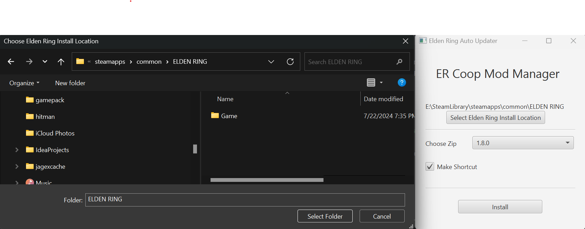

<p align="center">
   
</p>

[![Contributors][contributors-shield]][contributors-url]
[![Forks][forks-shield]][forks-url]
[![Stargazers][stars-shield]][stars-url]
[![Issues][issues-shield]][issues-url]
[![MIT License][license-shield]][license-url]

# Elden Ring Seamless Coop Mod Manager

The Elden Ring Seamless Coop Mod Manager is a Java application designed to simplify the process of managing and installing new versions of the Elden Ring Seamless Coop Mod. 
This tool automates version checking, downloading, and installation, ensuring you always have the latest version of the mod with minimal effort.

Features:

- One-Click Updates: Easily update to the latest version with a single click.
- Backup Management: Automatically creates backups of your current mod version and settings before updating.
- Mod Installation: Simplifies the process of installing the mod for first-time users.
- Version History: Keeps track of installed versions and allows for easy rollback if needed.
- Configuration: Saves your settings like ER Install location etc...
- Auto Find Mods: Automatically locates mod zip files in your Downloads folder

## System Requirements

- Windows 10 or later
- Java Runtime Environment (JRE) 11 or later
- Elden Ring game installed
- [The Elden Ring Seamless Coop mod](https://www.nexusmods.com/eldenring/mods/510?tab=files) zip file downloaded to your Downloads directory

**This software has only been tested for Windows since it is tightly coupled with the Elden Ring mod**

## Installation

Download the latest release of the Elden Ring Seamless Coop Mod Manager from the [Releases page](https://github.com/cbartram/elden-ring-auto-update/releases). 
Extract the downloaded ZIP file to a location of your choice. In the `bin` folder run the `esrc-mod-manager.bat` file to start the application.

You should see the GUI appear.

## Usage

On first run, the application will ask you to locate your Elden Ring installation directory. Generally this will be installed 
in `C:\SteamLibrary\steamapps\common\ELDEN RING`. Do **NOT** include the `Game` directory.

Simply click the "Select Elden Ring Install Location" to bring up a file picker and choose your `ELDEN RING` directory. On subsequent
runs you will not have to select this as a configuration file is generated and saved to `C:\Users\<you>\.esrc-config.json`.



The mod manager will automatically look in your `Downloads` directory for any Elden Ring Seamless Coop mod zip files.
Generally the correct and latest mod version should be selected however, if it is not you can use the "Choose Zip" button to select the version you would like to 
unpack and install.

Finally, you can select the "Make shortcut" option to create a shortcut for the Elden Ring Seamless Coop launcher exe file if you wish.

When you click "Install" the mod manager will install the selected version to the Elden Ring install location creating a backup of your settings file in case of 
corruption.

## Launching the Game

Use the "ersc_launcher.exe" file to start the game with the mod automatically applied. If you would like to create a shortcut
to this file to keep elsewhere make sure to check the "Create Shortcut" option from the UI.

# Development

## Creating a build

If you would like to create a new build run the `distZip` task with Gradle. This
will produce a zip in `./build/distributions/ersc-mod-manager-{version}-SNAPSHOT.zip`

You will use this artifact when creating a new release in GitHub

## Publishing a New GitHub Release

Follow these steps to publish a new release on GitHub:

1. **Update Version Number**:
    - Update the version number in the `build.gradle` version property.
    - Commit these changes:
      ```
      git commit -am "Bump version to X.Y.Z"
      ```

2. **Create a New Tag**:
    - Create a new tag with the version number:
      ```
      git tag vX.Y.Z
      ```
    - Push the tag to GitHub:
      ```
      git push origin vX.Y.Z
      ```

3. **Draft a New Release**:
    - Go to your GitHub repository.
    - Click on "Releases" in the right sidebar.
    - Click "Draft a new release".

4. **Fill in Release Details**:
    - Choose the tag you just created.
    - Set the release title (usually the version number).
    - Write release notes, including:
        - New features
        - Bug fixes
        - Any breaking changes

5. **Attach Build Artifacts** (if applicable):
    - Upload any compiled binaries or assets.

6. **Publish the Release**:
    - Review all information.
    - Click "Publish release".

7. **Verify the Release**:
    - Check that the release appears on your GitHub repository's releases page.
    - Ensure all attached artifacts are downloadable.

8. **Update Documentation** (if necessary):
    - Update any version-specific documentation on your wiki or website.

9. **Announce the Release**:
    - Inform your users through appropriate channels (e.g., mailing lists, social media).

Remember to follow semantic versioning (MAJOR.MINOR.PATCH) when choosing your version numbers. For more details on semantic versioning, visit [semver.org](https://semver.org/).

## Contributing

We welcome contributions to improve this project! Here's how you can help:

 - Fork the Repository: Start by forking the project repository to your GitHub account.
 - Clone the Forked Repository: Clone your fork to your local machine.

`git clone https://github.com/cbartram/elden-ring-coop-mod-manager.git`

 - Create a New Branch: Create a new branch for your feature or bug fix.

`git checkout -b feature/your-feature-name`

 - Make Your Changes: Implement your feature or bug fix.
 - Commit Your Changes: Commit your changes with a clear and descriptive commit message.

`git commit -m "Add a brief description of your changes"`

 - Push to Your Fork: Push your changes to your forked repository.

`git push origin feature/your-feature-name`

 - Submit a Pull Request: Go to the original project repository and submit a pull request with a clear description of your changes.
 - Code Review: Wait for the maintainers to review your pull request. Make any requested changes if needed.

Please ensure that your code adheres to the project's coding standards and includes appropriate tests if applicable.
Thank you for contributing to our project!

## License

This project is licensed under the MIT License - see the [LICENSE](./LICENSE) file for details.

## Acknowledgments

Thanks to the creators of the Elden Ring Seamless Coop Mod for their amazing work.
This project is not affiliated with or endorsed by FromSoftware, Inc. or Bandai Namco Entertainment.

## Contact

If you have any questions, issues, or suggestions, please open an issue on our GitHub repository and I will take a look
as soon as I am able!

## Built With

- Java 11 - Programming Language
- Java FX - UI Library for Java
- Lombok - Annotations for simplified Java development
- Gradle - Build Tool

[contributors-shield]: https://img.shields.io/github/contributors/cbartram/elden-ring-coop-mod-manager.svg?style=for-the-badge
[contributors-url]: https://github.com/cbartram/elden-ring-coop-mod-manager/graphs/contributors
[forks-shield]: https://img.shields.io/github/forks/cbartram/elden-ring-coop-mod-manager.svg?style=for-the-badge
[forks-url]: https://github.com/cbartram/elden-ring-coop-mod-manager/network/members
[stars-shield]: https://img.shields.io/github/stars/cbartram/elden-ring-coop-mod-manager.svg?style=for-the-badge
[stars-url]: https://github.com/cbartram/elden-ring-coop-mod-manager/stargazers
[issues-shield]: https://img.shields.io/github/issues/cbartram/elden-ring-coop-mod-manager.svg?style=for-the-badge
[issues-url]: https://github.com/cbartram/elden-ring-coop-mod-manager/issues
[license-shield]: https://img.shields.io/github/license/cbartram/elden-ring-coop-mod-manager.svg?style=for-the-badge
[license-url]: https://github.com/cbartram/elden-ring-coop-mod-manager/blob/master/LICENSE